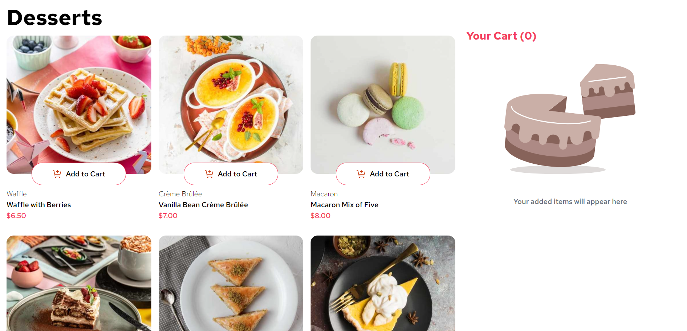

# Frontend Mentor - Dessert App Solution

This is a solution to the [Product list with cart challenge on Frontend Mentor](https://www.frontendmentor.io/challenges/product-list-with-cart-5MmqLVAp_d). This challenge helped improve my skills in building user interfaces using React and Tailwind CSS.

## Table of Contents

- [Overview](#overview)
  - [The Challenge](#the-challenge)
  - [Screenshot](#screenshot)
  - [Links](#links)
- [My Process](#my-process)
  - [Built With](#built-with)
  - [Continued Development](#continued-development)
  - [Useful Resources](#useful-resources)
- [Author](#author)
- [Acknowledgments](#acknowledgments)

## Overview

### The Challenge

Users should be able to:

- Add items to the cart and remove them.
- Increase/decrease the number of items in the cart.
- See an order confirmation modal when they click "Confirm Order".
- Reset their selections when they click "Start New Order".
- View the optimal layout for the interface depending on their device's screen size.
- See hover and focus states for all interactive elements on the page.

### Screenshot

### Links

- Live Site URL: [DEMO](https://varungaikwad.github.io/desserts-app/)

## My Process

### Built With

- Semantic HTML5 markup
- CSS custom properties
- Flexbox
- CSS Grid
- Mobile-first workflow
- [React](https://reactjs.org/) - JS library
- [Tailwind CSS](https://tailwindcss.com/) - For styling

### Continued Development

In the future, I plan to enhance this project by:

- Implementing local storage to save the cart state between sessions.
- Adding unit tests for the key components.
- Exploring further responsive design techniques.

### Useful Resources

- [Tailwind CSS Documentation](https://tailwindcss.com/docs) - This was helpful in understanding the utility-first approach.
- [React Docs](https://reactjs.org/docs/getting-started.html) - A great resource for understanding React fundamentals.

## Author

- Website - [Varun Gaikwad](https://varungaikwad.github.io/portfolio/)
- Frontend Mentor - [@VarunGaikwad](https://www.frontendmentor.io/profile/VarunGaikwad)
- LinkedIn - [Varun Gaikwad](https://www.linkedin.com/in/varun-gaikwad/)

## Acknowledgments

I would like to thank the Frontend Mentor community for the feedback and support. Special thanks to those who provided code reviews and insights.
